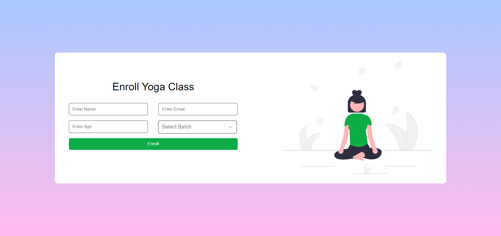
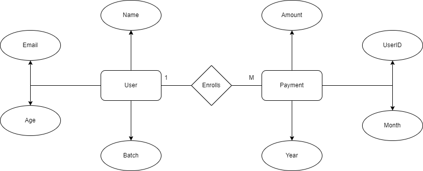

# Flexmoney Assignment

A web application for yoga classes was to be created as part of a FlexMoney assignment.

[Website Link](https://badjatya-flexmoney-assignment.netlify.app/)

## Screenshots

### Home Page


### Enroll Page



### Success Page


### ER Diagram



## Installation

- For Backend

  ```javascript
  npm install
  ```

- For Frontend

  ```javascript
  cd client
  npm install
  ```

## To Run

```javascript
npm dev
```

## Tech Stack Used

- MongoDB
- ExpressJS
- ReactJS
- NodeJS

## Backend Dependencies

- Cors
- Dotenv
- Mongoose
- Validator

## Frontend Dependencies

- Node Sass
- React Router Dom
- React Select
